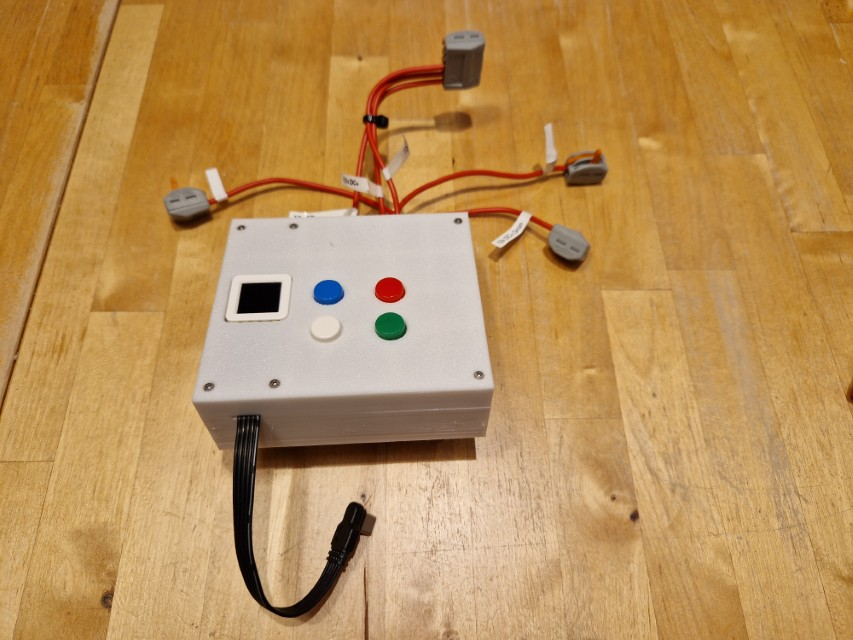
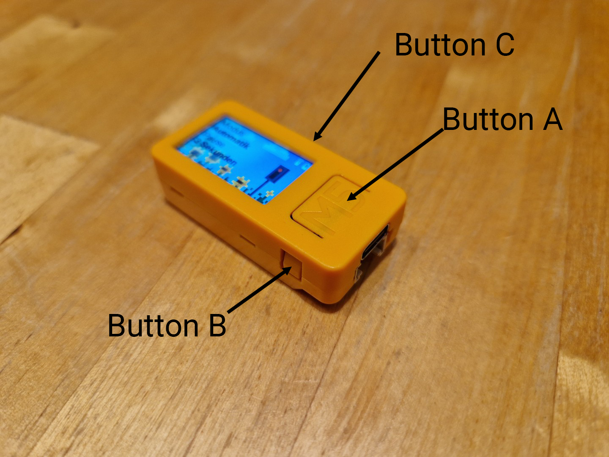

# traffic-light-controller



This project was developed for the daycare center of my daughter.

The controller for the traffic light uses a M5Stack AtomS3 development kit programmed with ESPHome.
The optional remote uses a M5Stack StickC Plus2 also programmed with ESPHome. For wireless communication ESP-NOW is used.

## traffic-light

### Functionality

* Blue button: switch between manual and automatic mode
* White button: change delay of automatic mode
* Green button: Switch to green (and switch to manual mode)
* White button: Switch to green (and switch to manual mode)

### Components

The listed components fit into the provided 3D printed case. You can also use other compatible components.

* 1x [AtomS3 Development Kit](https://docs.m5stack.com/en/core/AtomS3) (or newer AtromS3R)
* 2x [Seeedstudio Grova Dual Button](https://wiki.seeedstudio.com/Grove-Dual-Button/)
* 1x [ELGOO 4-Way relais module](https://www.amazon.de/dp/B01M8G4Y7Z)
* some jumper cables
* 1x jumper to grove cable (bought or homemade)
* 30x70mm hole pattern circuit board
* Soldering Iron + Solder + connecting cables
* straight Pin Headers

### Pin assignment

| pin    | usage            |
|--------|------------------|
| GPIO1  | operation mode   |
| GPIO2  | change delay     |
| GPIO38 | red button       |
| GPIO39 | green button     |
| GPIO5  | relay for green  |
| GPIO6  | relay for yellow |
| GPIO7  | relay for rot    |

### traffic-light case and housing

This case is designed to be placed into a 6x [f-tronic small distribution box](https://www.f-tronic.de/de/produkte/installationsverteiler/kleinverteiler/ap-feuchtraumverteiler/95/fr-kleinverteiler-ip55-1-reihig.html?number=7240051)
As power-supply a [Phoenix Contact 15w USB-C power supply](https://www.phoenixcontact.com/de-de/produkte/stromversorgung-step3-ps-1ac-5dc-3-pt-usb-c-1335698) can be used.

* 1x printed 3d Case TODO
* 3x [DIN Rail Clip](https://www.printables.com/model/537942-din-rail-clip-heat-insert-version/files)
* 14x M2 heat inserts (4mm height)
* 10x M3 heat inserts (4mm height)
* 6x M2 20mm Screws
* 8x M2 6mm screws
* 4x M3 16mm screws
* 3x M3 8mm screws
* 2x M3 12mm screws
* [flat USB cable](https://www.amazon.de/dp/B0DR1MXLFM)

### traffic-light-remote



### Functionality

Button A: 
* Short = switch lights (and switch to manual mode)
* Long = switch to automatic mode

Button B:
* Short = change delay of automatic mode
* Long = turn off/turn on

Button C:
* Hold = display help screem

### Components

* 1x [M5StickC-Plus2](https://docs.m5stack.com/en/core/M5StickC%20PLUS2)
* 1x [M5StickC PLUS2 Case](https://www.printables.com/model/897240-m5stickc-plus2-case)
* 1x Lanyard

## Start development environment

        ./docker-start.sh

Visit browser on http://localhost:6052/ and install the software using the ESPHome UI.

### Things you need to adjust

You need to provide the following secrets:
```
wifi_ssid: "<WIFI_SSID>"
wifi_password: "<WIFI_PASSWORD>"

mac_traffic_light_remote: "<MAC_OF_REMOTE>"
mac_traffic_light: "<MAC_OF_TRAFFIC_LIGHT"
```

## Images

See [images](./images/README.md) to get an impression of the project.

## Thanks

I want to thank the following projects / websites as they were very helpfull during building this.

* https://karlquinsland.com/esphome-dynamic-timer/ for the base of the timer
* https://esphome.io/ for providing the base for this project